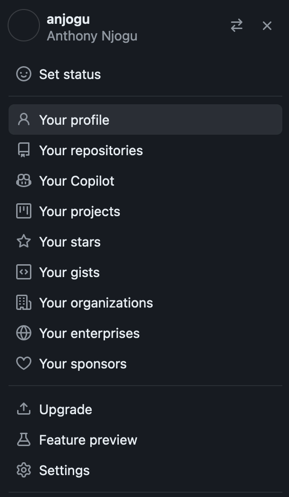
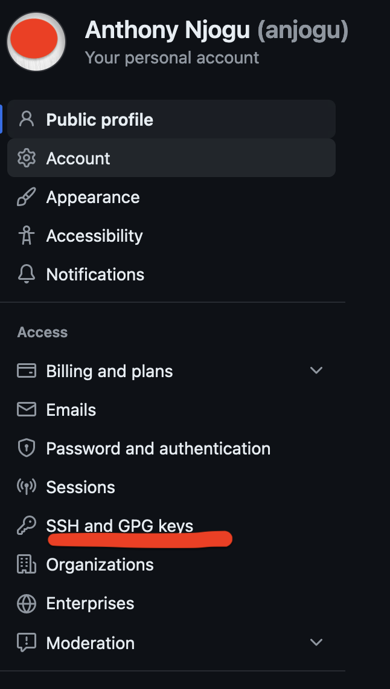
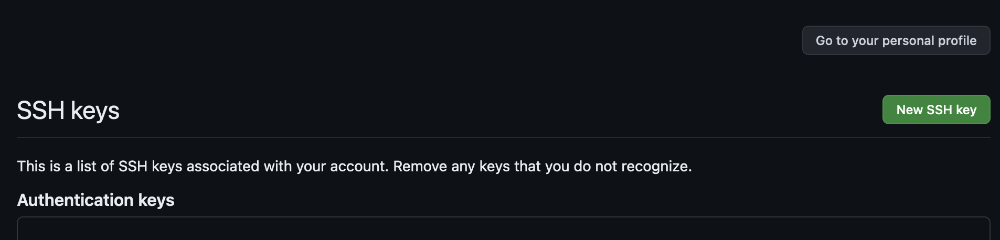
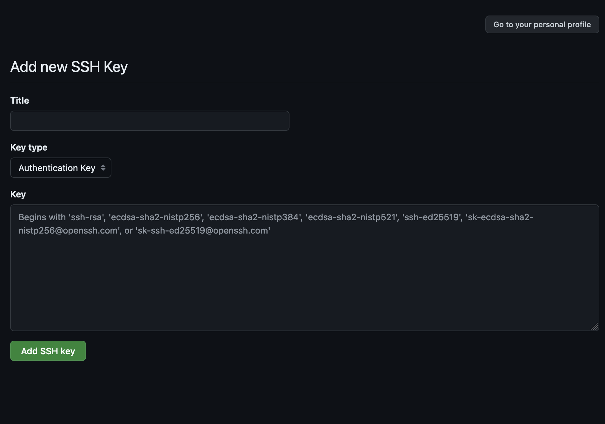

# LDSF Data Analysis in UK-PACT

## Before we get started...

We will be working in _R Statistics_ for the analysis of LDSF data. The R programming language is a dynamic language built for statistical computing and graphics. R is often used in statistical analysis, scientific computing, machine learning, and data visualization. For a comprehensive introduction to R for data science, [this book is highly recommended](https://r4ds.hadley.nz/). It takes you through the basics of R programming as well as more advanced topics for those already familiar with R. We will not be following the book in the workshop, but it is a great resource for learning R.

## Software needed for this workshop
#### Please install the following software ahead of the workshop:
1. **R Statistics**: You will need to install it on your computer. Navigate to the [R Project website](https://cloud.r-project.org/) and download the latest version of R for your operating system. Follow the installation instructions for your operating system.
2. **VS Code**: This is a versatile code editor that can be used for any programming language. It is lightweight and has a lot of features that make it a great choice for coding. You can download it from the [VS Code website](https://code.visualstudio.com/).
3. Install **Quarto** from the [Quarto website](https://quarto.org/). Quarto is a document processing tool that allows you to write documents in markdown and R code. We will be using Quarto withon VS Code to write our reports and analyses.
4. _Optional:_ - **GitHub** is a version control system that allows you to track changes in your code and collaborate with others. You can download Git from the [GitHub website](https://github.com/git-guides/install-git). Look for instructions for your operating system on this page and download the appropriate installer. For Windows, Git can also be installed through VS Code GitHub integration which is provided through the [GitHub Pull Requests and Issues](https://marketplace.visualstudio.com/items?itemName=GitHub.vscode-pull-request-github) extension.

#### In addition we will need to install the following:
We will cover the below topics at the start of the workshop, so don't worry if you have not completed these steps ahead of time. We will help you get set up. If you feel comfortable installing the below on your own, please go ahead and follow these steps:

a) Open VS Code and navigate to the _Extensions_ tab on the left sidebar. Search for and install the [R extension for Visual Studio Code](https://marketplace.visualstudio.com/items?itemName=REditorSupport.r).


b) Open R and install the languageserver package by running the following command in the R console:


Once R is started in the terminal, run the following command to install the languageserver package:

```R
install.packages("languageserver")
```

_(We will install additional libraries during the workshop as needed.)_

## What will you learn in the workshop?
We will cover a number of topics, including:
- Introduction to R and Quarto
- Quarto notebooks
- Loading LDSF data into R
- Data exploration and visualization
        - Summary statistics
        - Data visualization using ggplot2
        - Mapping data using leaflet
- Statistical analysis of LDSF data using mixed-effects models

All of the above exercises will be hands-on and conducted in Quarto (see above), which is a great tool for reproducible research. Quarto can be used for report writing, data analysis, and creating presentations.


# Introduction to GIT

## Installing GIT

For Mac and Linux users git is often preinstalled, but if it is not, one can install it using the steps below;


For Windows:
~~~
* Insert the URL "[https://git-scm.com/download/win](https://git-scm.com/download/win)" in your browser and select either 32 bit or 64 bit under "Standalone Installer" section.
* After downloading the installer file, run the installer wizard following the instructions(ensure you leave the installer sections as default).
* Once the installer has been installed successfully, it will load a blue screen with a manual on git
~~~

For Mac run:
~~~
	brew install git
~~~

For Linux run:
~~~
	sudo apt install git
~~~


## Creating a GitHub Account

Copy this URL _https://github.com_ to your browser to create an account, if you already have a GitHub, or Bitbucket account you can use it to log in or sign up alternatively use your Google or Twitter account.

## Create a Repository in GitHub

Once we have an account, we can create a repository in GitHub. We can create a new repository or import one to get started. After creating/importing a project you can use any of the following options.
To create a repository click on the "New" button next to the repository list on the left side of the screen.

## Generating a new SSH key pair

If using a Mac OS or Ubuntu machine, open a terminal, for Windows open Git Bash or command line(cmd).

Generate a new ED25519 SSH key pair:

~~~
ssh-keygen -t ed25519 -C "email@example.com"
~~~

Or use RSA:

~~~
ssh-keygen -o -t rsa -b 4096 -C "email@example.com"
~~~

Next, you will be prompted to input a file path to save your SSH key pair. If you don’t have an SSH key pair and aren’t generating a deploy key, use the suggested path by pressing “Enter”. This is good practice as you will not be required to do further configurations for the SSH client.

Once the path is decided, you will be prompted to input a password to secure your new SSH key pair. It’s a best practice to use a password, but it’s not required and you can skip creating it by pressing “Enter” twice.

__NB:__ If you want to add or change the password of your SSH key pair, you can use the -p flag:

~~~
	ssh-keygen -p -o -f <keyname>
~~~

## Adding an SSH KEY to a GitHub account

You can opt to open the file and copy all of its contents to GitHub or copy the public key to the clipboard by using any of the commands below depending on your system.


__Git Bash on Windows:__

~~~
	* notepad C:\Users\<your_computer_user>/.ssh/id_ed25519.pub
	* copy all the contents of the notepad document that opens i.e
	"ssh-ed25519 AAAAC3NzaC1lZDI1NTISYAAAIPBnygRvaPnjVogKEIolWB6CSElxU7EOyauhbmj37/mS email@email.com"
~~~

__macOS:__

~~~
 	pbcopy < ~/.ssh/id_ed25519.pub
~~~

__WSL / GNU/Linux (requires the xclip package):__

~~~
	xclip -sel clip < ~/.ssh/id_ed25519.pub
~~~

For the first option; open the file using any text editor and paste it to the GitHub SSH section as shown below(I use Ubuntu so I will demonstrate using the same):

~~~
	vim ~/.ssh/id_ed25519.pub
~~~

the file looks similar to this:

~~~
    ssh-ed25519 ABHW92CidDJDNJFNSJDJSKDNFKJNDSF/uidsh/djsfndisafhudj0 email.example.com
~~~

now on your GitHub account in your browser click on your profile in the top-right corner as shown below:


click on the dropdown arrow and select settings:



On the page that loads next, click on the SSH Keys section on the left side of the screen:



This will give us screens like the ones below where we can paste our SSH Key:



Click the _"New SSH Key"_ Button to get the screen below;



Provide a descriptive title, and click on the addkey button below it. Now with your SSH KEY set up you can proceed to add data to your repository using any of the scenarios below.

## Command line instructions

After a successful git installation on our laptop and a connection to the github.com account, restart your VScode application.
After restarting our VScode  we need to go to the Terminal section under VScode. 
Once we have our terminal up, let's make some configurations as described below;
Firstly, we will configure git globally on our computer. Run the commands below to achieve this;

~~~
	git config --global user.name "First Name Last Name"
	git config --global user.email "email@example.com"
~~~


If we are to push an existing folder to GitHub we can use the following command;

~~~
    # open your project on VSCode, and run the commands bewlow in the terminal 
    git init
    git remote add origin git@gitlab.com:a_njogu/samples.git
    git add .
    git commit -m "Initial commit"
    git push -u origin master
~~~

Next, we are going to clone the repository we created in the previous step(Create a Repository in GitHub);

~~~
    git clone git@gitlab.com:a_njogu/samples.git
    cd samples
    touch README.md
    git add README.md
    git commit -m "add README"
    git push -u origin master
~~~
We also have an option to push an existing Git repository. To achieve this, we need to use the following command;


~~~
    cd existing_repo
    git remote rename origin old-origin
    git remote add origin git@gitlab.com:a_njogu/samples.git
    git push -u origin --all
    git push -u origin --tags
~~~
